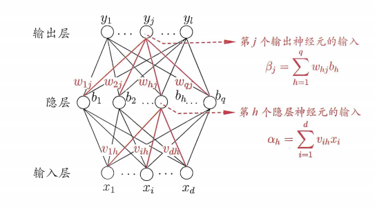
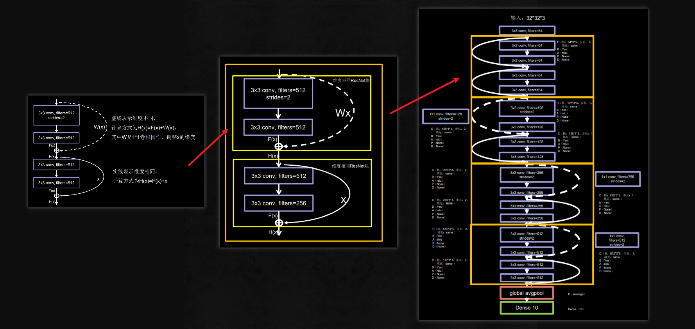

 @sofice

[TOC]


网络训练两大问题：

+ **梯度弥散/爆炸**

  基于梯度的BP算法的优化，反向传播中，根据链式法则，前一层误差依赖于后一层误差。如果梯度逐渐消失，底层的参数不能有效更新，这也就是梯度弥散(或梯度消失)；反之会使得梯度以指数级速度增大，造成系统不稳定，也就是梯度爆炸问题

  这个问题很大程度上已经被**标准初始化和中间层正规化方法**有效控制了，这些方法使得深度神经网络可以收敛

+ **网络退化问题**

  在神经网络可以收敛的前提下，随着网络深度增加，网络的表现先是逐渐增加至饱和，然后迅速下降，这不是过拟合导致的。如果存在某个 K 层的网络 f 是当前最优的网络，那么可以构造一个更深的网络，其最后几层仅是该网络 f 第 K 层输出的恒等映射(Identity Mapping)，就可以取得与 f 一致的结果；也许 K 还不是所谓“最佳层数”，那么更深的网络就可以取得更好的结果。总而言之，与浅层网络相比，更深的网络的表现不应该更差。因此，一个合理的猜测就是，**对神经网络来说，恒等映射并不容易拟合**


用于模式识别


**若干输入，乘上权重，通过S阈值函数，得到输出**

权重初始值可以为随机值，正态分布，均值为0，方差为
$$
\cfrac{1}{\sqrt{inodes}}
$$
`self.wih = numpy.random.normal(0.0, pow(self.inodes, -0.5), (self.hnodes, self.inodes))`


**Hebb学习规则**

无监督，在同一时间被激发的神经元间的联系会被强化。

$w_{ij}(t+1)=w_{ij}(t)+\eta y_iy_j$，$w_{ij}$为神经元 i j 之间的连接权重，$y_i,y_j\in\{-1,1\}$为神经元输出。同时激活或同时抑制会增加权重

**Delta学习规则**

有监督，根据神经元的实际输出与期望输出差别来调整连接权。

$w_{ij}(t+1)=w_{ij}(t)+\eta (d_i-y_i)x_j(t)$，$d_i$为第 i 个神经元的期望输出，$y_i$为第 i 个神经元的实际输出，$x_j$为第 j 个神经元的状态。若神经元实际输出比期望输出大，则减少输入为正的连接的权重，增大所有输入为负的连接的权重。反之，则增大所有输入为正的连接权的权重，减少所有输入为负的连接权的权重。


# 实践方法论

## 超参数

| 超参数       | 容量何时增加 | 原因                                                         | 注意事项                                                     |
| ------------ | ------------ | ------------------------------------------------------------ | ------------------------------------------------------------ |
| 隐藏单元数量 | 增加         | 增加隐藏单元数量会增加模型的表示能力                         | 几乎模型每个操作所需的时间和内存代价都会随隐藏单元数量的增加而增加 |
| 学习率       | 调至最优     | 不正确的学习速率，不管是太高还是太低都会由于优化失败而导致低有效容量的模型 |                                                              |
| 卷积核宽度   | 增加         | 增加卷积核宽度会增加模型的参数数量                           | 较宽的卷积核导致较窄的输出尺寸，除非使用隐式零填充减少此影响，否则会降低模型容量。较宽的卷积核需要更多的内存存储参数，并会增加运行时间，但较窄的输出会降低内存代价 |
| 隐式零填充   | 增加         | 在卷积之前隐式添加零能保持较大尺寸的表示                     | 大多数操作的时间和内存代价会增加                             |
| 权重衰减系数 | 降低         | 降低权重衰减系数使得模型参数可以自由地变大                   |                                                              |
| Dropout 比率 | 降低         | 较少地丢弃单元可以更多地让单元彼此 ‘‘协力’’ 来适应训练集     |                                                              |

网格搜索：参数较少时适用，通常在对数尺度下挑选值

随机搜索：为每个超参数定义一个边缘分布，能更快的收敛


# 深度前馈网络(Deep Feedforward Network)

即**多层感知机(multilayer perceptron, MLP)**，深度学习**自动学习非线性变换**$\phi(x)$，使之能用于线性模型

**全连接神经网络**：每层神经元与下一层全连接，神经元不存在同层连接，也不存在跨层连接

避免**过拟合**：

+ 早停：若训练集误差降低但验证机误差升高，则停止训练
+ 正则化：加上网络复杂度权重

避免**局部极小**：

+ 多组初始值
+ 模拟退火法
+ 随机梯度下降

## 参数学习

**正向传播**


**反向传播**

反向传播误差进行自学习，自动调整权重

梯度下降法求得误差对各传播路径的权重

标准BP：累计BP = SGD：GD


$$
设\quad 隐层第h个单元的阈值为\,\gamma_h\quad 输出层第j个单元的阈值为\,\theta_j\\
对于训练样例(x_k,y_k)，神经网络输出为\hat{y}_j^k=f(\beta_j-\theta_j)\quad 均方误差为E_k=\frac12\sum_{j=1}^l(\hat{y}_j^k-y_j^k)^2\\
g_j=-\frac{\part E_k}{\part \hat{y}_j^k}\cdot\frac{\part \hat{y}_j^k}{\part \beta_j}=-\hat{y}_j^k(1-\hat{y}_j^k)(\hat{y}_j^k-y_j^k),\quad e_h=-\frac{\part E_k}{\part b_h}\cdot\frac{\part b_h}{\part \alpha_h}=b_h(1-b_h)\sum_{j=1}^lw_{hj}g_j\\
\begin{cases} \Delta w_{hj}=\eta g_jb_h \\
\Delta \theta_j=-\eta g_j \\
\Delta v_{ih}=\eta e_hx_i \\
\Delta \gamma_h=-\eta e_h \end{cases}
$$


**指数衰减学习率**

$指数衰减学习率=初始学习率*学习率衰减率^{当前轮数/多少轮衰减一次}$

```python
epoch = 40
LR_BASE = 0.2  # 最初学习率
LR_DECAY = 0.99  # 学习率衰减率
LR_STEP = 1  # 喂入多少轮BATCH_SIZE后，更新一次学习率

for epoch in range(epoch):  # for epoch 定义顶层循环，表示对数据集循环epoch次，此例数据集数据仅有1个w,初始化时候constant赋值为5，循环100次迭代。
    lr = LR_BASE * LR_DECAY ** (epoch / LR_STEP)
    with tf.GradientTape() as tape:  # with结构到grads框起了梯度的计算过程。
        loss = tf.square(w + 1)
    grads = tape.gradient(loss, w)  # .gradient函数告知谁对谁求导

    w.assign_sub(lr * grads)  # .assign_sub 对变量做自减 即：w -= lr*grads 即 w = w - lr*grads
    print("After %s epoch,w is %f,loss is %f,lr is %f" % (epoch, w.numpy(), loss, lr))

```

**参数个数**

$\sum_{各层}(前层\times后层+后层)$


## 激活函数

用来进行非线性变换

+ **sigmoid函数**

   ${f}'(x)=f(x)(1-f(x))$
  
+ **tanh函数**

+ **relu函数(rectified linear unit,整流线性单元)**

  $\large g(x)=max\{0,x\}$      	

+ **leaky_relu函数**


# 正则化

修改学习算法，**减少泛化误差**

通常设计为编码特定类型的先验知识或偏好简单模型

依赖于对矩阵$X^TX$求逆的一些线性模型中，如果$X^TX$是奇异的，方法就会失效。这时正则化就对应求逆$X^TX+\alpha I$，来保证矩阵可逆，使线性问题有闭式解


- **参数范数惩罚**

  $\large \tilde{J}(\theta;X,y)=J(\theta;X,y)+\alpha\Omega(\theta)$

  通常只对权重而不对偏置做惩罚，每个偏置仅控制一个单变量，不正则化也不会导致太大的方差

  L1正则化会产生更稀疏的解，L2正则化会使参数更容易减小降低复杂度

- **作为约束的范数惩罚**

  对于经过参数范数正则化的代价函数，如果想约束惩罚函数小于某个常数k，可以构建Lagrange函数：

  $\large L(\theta,\alpha;X,y)=J(\theta;X,y)+\alpha\Omega(\theta-k),\quad \theta^*=argmin_\theta\, max_\alpha L(\theta,\alpha)$

  固定 $\alpha$ 后可看成等价于最小化 $\tilde{J}$ 的正则化训练问题

- **数据集增强**

  **分类任务主要是对各种各样的变换保持不变**

  可以通过**转换数据集中的x**来生成新的 (x,y) 对，如：图像的平移，旋转，缩放等，但是不能改变类别（翻转影响"6"和"9"的识别）

  可以通过**输入噪声**来增强网络的健壮性，如：输入噪声注入（去噪自编码器），隐藏层噪声注入（dropout），输出噪声注入（标签平滑）

- **半监督学习**

  生成模型与判别模型、有监督与无监督共享参数

- **多任务学习**

  多个任务具有共享参数，也有各自任务的参数，表明某些因素影响多个任务

- **提前终止**

  验证集的误差在规定的循环次数内没有进一步改善时，算法终止

- **参数绑定和参数共享**

  假设两个模型执行相同的任务，输入分布相似，则可认为模型参数应该靠近

  正则化一个模型（监督模式下训练的分类器），使其接近另一个无监督模式下训练的模型（捕捉到输入数据的分布）的参数

  或直接进行参数约束（强迫某些参数相等）

  广泛应用于CNN中

- **稀疏表示**

  惩罚网络中的**激活单元**而不是直接惩罚模型参数，稀疏化激活单元，间接对模型参数施加了复杂惩罚

- **集成方法**

  Bagging：通过重采样来找出差异，结合几个模型来降低泛化误差

  Boosting：容量更高的集成模型

- **Dropout**

  训练时丢弃部分单元不进行训练，减少训练时间和模型容量；使用时，被舍弃的神经元恢复链接。

  设一个**二值掩码向量**$\mu$ 指定被包括的单元，$J(\theta,\mu)$定义模型的代价，通过对$\mu$采样来实现dropout，获得梯度的无偏估计

  				

  与Bagging不同的地方在于：Bagging应用于大型神经网络时集成度少；Dropout所有模型共享参数，单个步骤中训练一小部分子网络

  优点：计算方便，不怎么限制模型和训练过程（训练样本不要太少即可）

- **对抗训练**

  在对抗扰动的训练集样本上训练网络，可以减少原有独立同分布的测试机的错误率


# 模型优化

**残差连接**


通过将输入x与输入的非线性变换$F(x)$做线性叠加，得到**跳连接(skip connection)**，解决了深层神经网络难以训练的问题

**神经网络的退化**才是难以训练深层网络根本原因所在，而不是梯度消散。虽然梯度范数大，但是如果网络的可用自由度对这些范数的贡献非常不均衡，也就是每个层中只有少量的隐藏单元对不同的输入改变它们的激活值，而大部分隐藏单元对不同的输入都是相同的反应，此时整个权重矩阵的秩不高。并且随着网络层数的增加，连乘后使得整个秩变的更低。也即深层神经网络的权重矩阵虽然是一个很高维的矩阵，但是大部分维度却没有信息，表达能力没有看起来那么强大。**残差连接打破了网络的对称性**


**批标准化(BN)**

使数据符合0均值，1为标准差的分布，$H_i^k=\cfrac{H_i^k-\mu_{batch}^k}{\sigma_{batch}^k}$，标准化可以是数据重新回归到标准正态分布，常用在卷积操作和激活操作之间

使进入到激活函数的数据分布在激活函数线性区使得输入数据的微小变化更明显的提现到激活函数的输出，提升了激活函数对输入数据的区分力。但是这种简单的特征数据标准化使特征数据完全满足标准正态分布，集中在激活函数中心的线性区域，使激活函数丧失了非线性特性。

因此在BN操作中为每个卷积核引入了两个可训练参数，**缩放因子$\gamma$和偏移因子**$\beta$，反向传播时缩放因子$\gamma$和偏移因子$\beta$会与其他带训练参数一同被训练优化。通过缩放因子和偏移因子优化了特征数据分布的宽窄和偏移量。保证了网络的非线性表的力。


优化器

进行参数优化，减小loss，增大accuracy

待优化参数w，损失函数loss，学习率lr，t表示当前batch迭代的总次数

1. 计算t时刻损失函数关于当前参数的梯度$g_t$
2. 计算t时刻一阶动量$m_t$和二阶动量$V_t$
3. 计算t时刻下降梯度$\eta_t=lr\cdot m_t\sqrt{V_t}$
4. 计算t+1时刻参数$w_{t+1}=w_t-\eta_t$

+ SGD：$m_t=g_t$，$V_t=1$

+ SGDM：$m_t=\beta\cdot m_{t-1}+(1-\beta)\cdot g_t$，$V_t=1$，$\beta=0.9$

+ Adagrad：$m_t=g_t$，$V_t=\sum_{\tau=1}^{t}g_{\tau}^2$

+ RMSProp：$m_t=g_t$，$V_t=\beta\cdot V_{t-1}+(1-\beta)\cdot g_t^2$

+ Adam：$m_t=\beta\cdot m_{t-1}+(1-\beta)\cdot g_t$，$V_t=\beta\cdot V_{t-1}+(1-\beta)\cdot g_t^2$

  $\hat{m_t}=\cfrac{m_t}{1-\beta_1^t}$，$\hat{V_t}=\cfrac{V_t}{1-\beta_2^t}$


数据规模

+ 批量学习(BGD)

  每次计算全部样本；可抑制噪声，鲁棒性强，但时间开销大

+ 在线学习(SGD)

  每次用一个样本更新权重；可能无法收敛（可通过降低学习率来解决），单个样本影响过大

+ 小批量梯度下降法(MSGD)

  将数据集划分为若干batch，每次选取一个样本子集进行训练，综合了BGD与SGD的优点

  

# 卷积神经网络(Convolutional Neural Networks,CNN)

一般卷积神经网络被视为少量相对复杂的层，每层具有许多“级”，经典的包括：卷积级（仿射变换），探测级（非线性变换），池化级

**特征提取步骤CBAPD**：卷积-批标准化-激活-池化-舍弃


- **感受野(receptive field)**：

  卷积输出单位在原始层上的映射区域大小

- **全零填充**

  保证输出与输入尺度相同

  填充`padding='SAME'`：$输出=\lceil输入/步长\rceil$
  不填充`padding='VALID'`： $输出=\lceil输入-核长+1/步长\rceil$

## 卷积运算

连续形式卷积运算：$s(t)=(x*w)(t)=\int x(a)w(t-a)da$；离散形式卷积运算：$s(t)=\sum_{a=-\infty}^\infty x(a)w(t-a)$

二维矩阵上的卷积需要使用二维的核：$S(i,j)=(I*K)(i,j)=\sum_m\sum_n I(m,n)K(i-m,j-n)$，为计算简便，将核进行翻转，使用卷积的可交换性，减小m,n的范围：$S(i,j)=(K*I)(i,j)=\sum_m\sum_n I(i-m,j-n)K(m,n)$；但实际操作时，通常使用**互相关函数**，和卷积运算几乎一样但是没有核翻转：$S(i,j)=(I*K)(i,j)=\sum_m\sum_n I(i+m,j+n)K(m,n)$


## 重要特征

**稀疏交互(sparse interactions)**

核大小远小于输入大小，存储参数相比全连接网络更少，计算量更小；虽然直接连接都是很稀疏的，但处在更深层中的单元可以间接连接到大部分输入单元


**参数共享(parameter sharing)**

指在一个模型的多个函数中使用相同的参数。在CNN中只需要存储卷积核，相比全连接网络的参数矩阵，参数量要少很多


**等变表示(equivariant representations)**

等变：一个函数满足输入改变，输出也以同样方式改变；

函数等变：如果函数$f(x)$与$g(x)$满足$f(g(x))=g(f(x))$，则$f(x)$对于变换 $g$ 具有等变性

卷积具有**平移等变性**，即先平移再卷积与先卷积再平移的结果一样


## 池化

使用某一位置的相邻输出的总体统计特征来代替网络在该位置的输出

用于**降采样**（步长不为1，减少特征数据量和计算量），并且有**局部平移不变性**（近似不变，关注某个特征是否出现而不关心具体位置时有用）

**最大值池化**可提取图片纹理，**均值池化**可保留背景特征

池化层误差传播只在特定单元之间传播（如最大值池化中，本层只有每组含最大值的单元与后一层单元之间传播）


## 调参

通常情况下

+ **卷积核数目**越多识别性能越好

+ ReLU和maxout**激活函数**比sigmoid和tanh好

+ **预处理**（ZCA白化，GCN，归一化）对识别性能提升明显
+ 卷积核大小不会对误识别率产生显著影响，通常用5X5卷积核

+ 全连接层个数对识别性能影响不大

+ Dropout，归一化层能略微提升性能
+ 不同学习率，不同Mini-Batch对性能影响不大


## 经典卷积神经网络

+ **LeNet**

  由Yann LeCun于1998年提出，是卷积网络的开篇之作

  共享卷积核，减少网络参数

  

+ **AlexNet**

  AlexNet网络诞生于2012年，当年ImageNet竞赛的冠军，Top5错误率为16.4%

  使用“relu”激活函数，提升了训练速度，使用Dropout缓解过拟合

  

+ **VGGNet**

  VGGNet诞生于2014年，当年ImageNet竞赛的亚军，Top5错误率减小到7.3%
  使用小尺寸卷积核，在减少参数的同时提高了识别的准确率，网络规整适合硬件加速

  

+ **InceptionNet**

  InceptionNet诞生于2014年，当年ImageNet竞赛冠军，Top5错误率为6.67%
  InceptionNet引入了Inception结构块，在同一层网络内使用不同尺寸的卷积核，提升了模型感知力使用了批标准化缓解了梯度消失

  

+ **ResNet**

  ResNet诞生于2015年，当年ImageNet竞赛冠军，Top5错误率为3.57%

  


# 序列建模

处理序列的模型，包括时间序列，语言序列等

## 展开计算图

对展开递归或循环得到重复结构，使深度网络结构中的参数共享

展开后的计算图表明，无论序列多长，模型始终具有相同输入大小（指定从一种状态转移到另一种状态，而不是在可变长度的历史状态上操作），并且在每个时间步使用相同参数的转移函数

$\large h^{(t)}=f(h^{(t-1)},x^{(t)};\theta)$


## 循环神经网络(Recurrent Neural Network,RNN)

### 设计模式

1. **隐藏单元直接连接，每步输出**

   上一步隐藏状态h与下一步隐藏状态h连接最具有代表性，可以选择过去的任何信息放入隐藏表示 h 中并将 h 传播到未来

   

2. **隐藏单元间接连接，每步输出**

   上一步输出o与下一步隐藏状态h连接，没有隐藏状态的直接连接。o通常缺乏过去的重要信息，不如(1)强大，但训练速度更快，因为可以应用**导师驱动过程(teacher forcing)**：训练时将$y^{(t)}$反馈到$h^{(t+1)}$，测试时用输出$o^{(t)}$近似$y^{(t)}$反馈模型，因此可以增加并行训练

   

3. **隐藏单元直接连接，末尾输出**

   在序列结束时具有单个输出，可用于概括序列并产生进一步处理的固定大小的表示

   

### 传播公式


## 双向RNN(BiRNN)

结合过去和未来对现在的影响


## 长短期记忆网络(LSTM)


LSTM有两个传输状态：$c^t$（细胞状态）和 $h^t$（隐藏状态）；$c^t$改变得很慢，$h^t$则在不同单元处有很大的区别

**门(Gate)**：一种可选地让信息通过的方式，由一个 $\sigma$（Sigmoid神经网络层）和一个 $\otimes$（Hadamard product运算组成）

LSTM有三个门，用于保护和控制细胞的状态：

- **遗忘门(forget gate)**

  

  忘记阶段，对上一个节点传进来的细胞状态进行选择性忘记，通过计算得到的 $f_t$ 得到 $c_{t-1}$ 的**保留程度**

  $W_f,b_f$分别代表遗忘门的权重和偏置

- **记忆门(information gate)**

  

  选择记忆阶段，对输入进行选择记忆，$i_t$表示输入内容需要被记忆的部分，$\tilde{C}_t$表示输入内容的**记忆程度**

  

  计算完遗忘门和记忆门后，更新 $C_{t-1}$ 的值，得到 $C_t$

- **输出门(output gate)**

  

  输出阶段，决定哪些将会被当成当前状态的输出$h_t$，$o_t$表示输入内容中需要被输出，$tanh(C_t)$表示对上一个细胞状态的放缩


## 门控循环单元(Gated Recurrent Unit,GRU)


1. **更新门(update gate)**$z_t$：表示$h_{t-1}$有多少被更新；**重置门(reset gate) **$r_t$：控制需要保留多少之前的记忆
2. 将状态$h_{t-1}$重置后与$x_t$拼接，得到$\tilde{h}_t$，得到候选隐藏状态
3. 对状态$h_{t-1}$更新，得到$h_t$

这里的遗忘 $z_t$ 和选择 $(z_t-1)$ 是联动的


## 递归神经网络

树状计算图

对于具有相同长度 t 的序列，深度可以急剧地从 t 减小为 *O*(log t )，这可能有助于解决长期以来依赖问题

问题是如何构造最佳的树结构


## Encoder-Decoder

将输入序列映射到不一定等长的输出序列中

Encoder将输入序列编码成一个固定的中间表示向量 $C$，Decoder将 $C$解码成目标序列


基本的Encoder-Decoder模型**局限性**：编码器要将整个序列的信息压缩进一个固定长度的向量中去，编码和解码之间的唯一联系就是一个固定长度的语义向量c，导致：

- 语义向量无法完全表示整个序列的信息，不适用于长序列
- 先输入的内容携带的信息会被后输入的信息稀释掉


## Attention Mechanism

为了解决基本的Encoder-Decoder模型的局限性，在产生输出的时候，还会产生一个“注意力范围”，表示接下来输出的时候要重点关注输入序列中的哪些部分，然后根据关注的区域来产生下一个输出

将固定的中间表示 $C$ 换成了根据当前输出单元来调整成加入注意力模型的变化的$C_i$，每个$C_i$可能对应着不同的源单元的注意力分配概率分布

在机器翻译中，本质上是目标语单词和源语单词之间的一种**单词对齐机制**


$$
\large{
c_i=\sum_{j=1}^{L_x}a_{ij}h_j\\
L_x：源序列长度,\quad \alpha_{ij}：计算目标序列中第i个单元时对应的源序列中第j个单元的权重,\quad h_j：源序列中第j个隐状态
}
$$
**Attention的本质**

软寻址：源序列为<Key,Value>对，给定查询（目标序列中的一个单元），通过计算Query和每个Key的相关性，得到对应的Value，再加权求和即可

实际Key和Value指向的都是源序列单元的隐变量


计算分为三个阶段：求相似度，归一化，加权平均


$$
\large{
Attention(Query,Source)=\sum_{i=1}^{L_x}Similarity(Query,Key_i)*Value_i\\
1.Similarity:Sim_{点积}=Query\cdot Key_i\quad Sim_{cosine}=\cfrac{Query\cdot Key_i}{||Query||\cdot ||Key_i||}\quad Sim_{MLP}=MLP(Query,Key_i)\\
2.\alpha_i=softmax(Sim_i)=\cfrac{exp(Sim_i)}{\sum_{k=1}^{T_x}exp(Sim_i)}\\
3.Attention(Query,Source)=\sum_{i=1}^{L_x}\alpha_i*Value_i
}
$$


**Soft Attention 和Hard Attention：**

- Soft Attention：参数化，可导，可进行梯度反向传播，能被嵌入到模型中去，直接训练
- Hard Attention：随机过程，依概率Si来采样输入端的隐状态一部分来进行计算，而不是整个encoder的隐状态，需要采用蒙特卡洛采样的方法来估计模块的梯度


**Global Attention 和 Local Attention：**

- Global Attention：
- Local Attention：


**Self Attention：**

Target=Source这种特殊情况下的注意力计算机制

直接将序列中任意两个单元的联系通过一个计算步骤直接联系起来，远距离依赖特征之间的距离被极大缩短，有利于有效地利用这些特征

在机器翻译中，可以捕获同一个句子中单词之间的一些句法特征或语义特征


**Scaled Dot-Product Attention**

$$
\large{
Attention(Q,K,V)=softmax(\cfrac{Q\cdot K^T}{\sqrt{d_k}})\cdot V\\
Q\in\R^{n\times d_k}\quad K\in\R^{m\times d_k}\quad V\in\R^{m\times d_v}\quad
}
$$

使用矩阵点积运算并归一化的Attention计算公式，相当于将$n\times d_k$的序列$Q$编码成了一个新的$n\times d_v$的序列

使用点积而不使用加法是因为GPU处理矩阵乘法有优化；除以$\sqrt{d_k}$是为了使方差为1，内积不会太大，否则softmax后非0即1


**Multi-Head Attention**

计算多次Attention，每次使用的参数不共享，计算出来h个head的Attention后拼接；

由于每个head的维度有缩减，计算复杂度与全维度单head的Attention相当

可以允许模型在不同的表示子空间里学习到相关的信息（比如短语结构信息），多个head学习到的Attention侧重点可能略有不同，这样给了模型更大的容量


​	


# 相互连接型神经网络

网络不分层，单元之间相互连接，能够根据单元的值记忆网络状态，即**联想记忆**

可用于去除输入数据中的噪声

## Hopfield神经网络

一种相互连接型神经网络

优点：

+ 单元之间的连接权重对称
+ 每个单元没有到自身的链接
+ 单元的状态变化采用随机异步更新方式，每次只有一个单元改变状态

**联想记忆**

使用数据不断训练，单元的状态会一直变化，直到满足终止判断条件，网络达到稳定，此时各单元最终状态就是输出模式 y

记第 i 个单元在 t 时刻输入为：$u_i(t)=\sum_{j=1}^n w_{ij}x_j(t)-b_i(t)$

即当**来自其他单元的输入的加权和大于阈值**时，单元输出为1；小于为0；等于则不变

**能量函数**：$E=-\frac12\sum_{i=1}^n\sum_{j=1}^nw_{ij}x_ix_j+\sum_{i=1}^nb_ix_i$

且有$\Delta E_k=-u_k\Delta x_k$ 

随着时间增加，E逐渐减小，直到 $E=0$ 时，更新终止

输入时，将P个模式 $x^s=(x_1^s,x_2^s,...,x_n^s)(s=1,2,...,P)$ 输入到网络中，求与模式对应能量函数的极小值

假设：1. 所有单元阈值为0；2. $w_{ij}^s=x_i^sx_j^s$；此时能量函数可收敛于极小值，所有模式权重为 $w_{ij}=\frac1P\sum_{s=1}^Px_i^sx_j^s$ 


Hopfield神经网络可以识别带噪声的模式，因此可用于去噪

但模式太多时（可记忆模式数量阈值约为单元数的15%），Hopfield神经网络会发生串扰或陷入局部最优解


## 玻尔兹曼机(Boltzmann Machine,BM)

为解决Hopfield神经网络中发生串扰或陷入局部最优解的问题，玻尔兹曼机在Hopfield神经网络基础上进行改进，**输出不再是确定的，而是按照某种概率分布决定**
$$
p(x_i=1|u_i)=\cfrac{exp(\cfrac{x}{kT})}{1+exp(\cfrac{x}{kT})}\\
p(x_i=0|u_i)=\cfrac{1}{1+exp(\cfrac{x}{kT})}
$$
**温度系数** T>0；T越小，E达到极小值的概率越大，收敛越慢；可使用**模拟退火法**调整温度系数T
$$
玻尔兹曼分布\quad\quad p(x_n|\theta)=\cfrac{1}{Z(\theta)}exp\{-E(x,\theta)\} \\
归一化常数\quad\quad Z(\theta)=\sum_x exp\{-E(x,\theta)\} \\
所有连接权重w和偏置b\quad\quad \theta \\
对数似然函数\quad\quad logL(\theta)=\sum_{n=1}^Nlog p(x_n|\theta)
$$
通过求对w和b的相关梯度，可求出梯度下降值

但似然函数基于所有单元组合计算，**计算量庞大**，可使用近似算法——对比散度算法 解决

玻尔兹曼机含有隐藏单元，会影响可见单元的概率，会增加计算量


## 受限玻尔兹曼机(Restricted Boltzmann Machine,RBM)

分为可见层和隐藏层，层内单元之间无连接，层间相互连接


其可见变量v和隐藏变量h的联合配置(joint configuration)的能量为：

v和h的联合概率：

同样每次计算需要输入模式总和，计算量大，可使用Gibbs采样进行迭代计算求近似解，或CD算法


## 对比散度算法(Contrastive Divergence)

近似算法，能通过较少迭代次数计算出参数调整值


## 深度信念网络

由多层RBM堆叠组成，使用CD算法，逐层调整参数

既可当做生成模型使用，也可当做判别模型使用（在顶层添加特殊层，如softmax层）


# 自编码器(autoencoder,AE)

自编码器是一种能够通过无监督学习，学到输入数据高效表示的神经网络


通过学习编码器和解码器的参数，训练出一个尽可能重构出原始数据的网络，误差函数可选择最小二乘误差或交叉熵代价函数

+ 自动编码器是**数据相关的**（data-specific 或 data-dependent）
+ 自动编码器是**有损的**

训练后的参数可以作为神经网络的参数初始值

## 去噪自编码器

训练样本加上噪声，通过自编码器得到重构结果，将不含噪声的原始训练样本与重构结果计算误差

作用：

+ 保持输入样本不变的条件下，提取能够更好反映样本属性的特征
+ 消除输入样本中包含的噪声


## 稀疏自编码器

中间层单元太少会很难重构输入样本，太多会降低效率，为此加入正则化项，使大部分单元输出变为了0


## 栈式自编码器

相似于深度信念网络，将多层自编码器进行逐层训练，这样就能逐层完成低维到高维的特征提取


